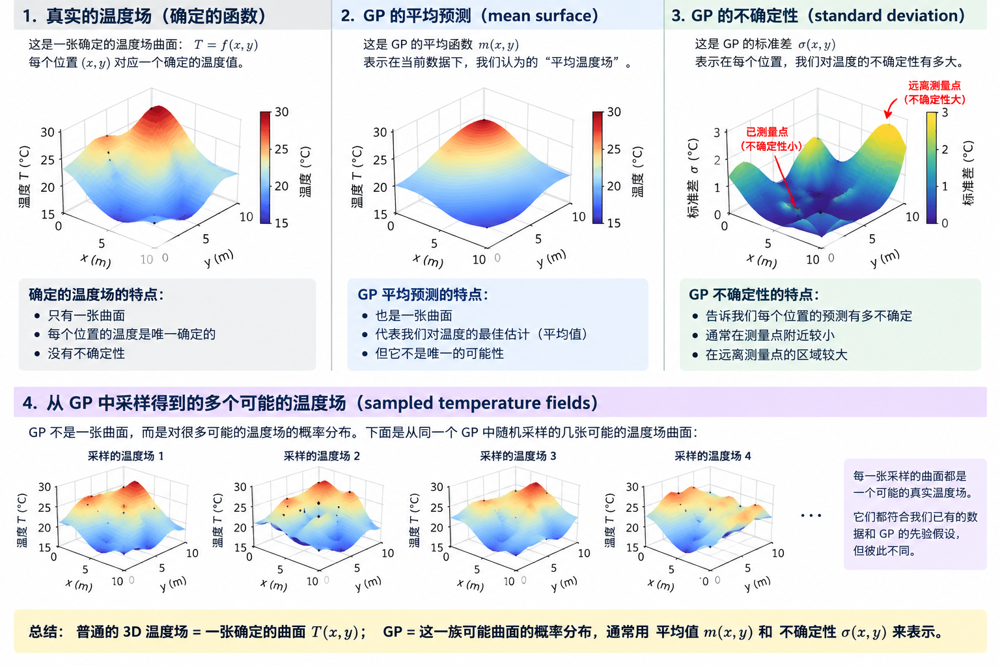
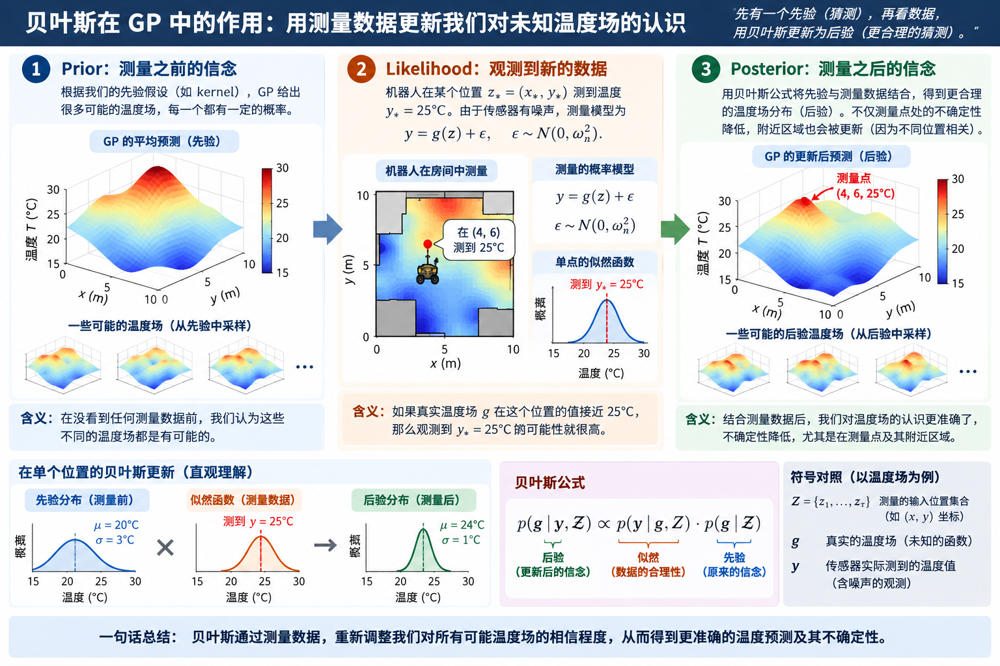

# Gaussian Process 与 Gaussian Process Regression：WELL-E 温度场学习笔记

> 主要技术来源：M. Liu, G. Chowdhary, B. Castro da Silva, S.-Y. Liu, and J. P. How, “Gaussian Processes for Learning and Control: A Tutorial with Examples,” _IEEE Control Systems Magazine_, 2018。本文只整理 GP/GPR 的入门部分，不展开 Sparse GP、GP-MRAC、Reinforcement Learning 或 Inverse Reinforcement Learning。

## 1. WELL-E 到底要解决什么问题

真实环境中存在一个未知温度场：

$$
T=g(x,y).
$$

WELL-E 只能在少量空间位置测量温度，不可能先把整个区域逐点测完。我们希望用 Gaussian Process（GP）和 Gaussian Process Regression（GPR）完成三件事：

1. 预测未测位置的温度；
2. 给出这些预测的不确定性；
3. 把不确定性提供给 Informative Path Planning，决定下一步去哪里测量最有价值。

核心不是只拟合一张温度曲面，而是同时得到：

$$
\text{temperature mean map}+\text{uncertainty map}.
$$

---

## 2. 普通 Gaussian distribution 与 GP 的区别

### 2.1 Scalar Gaussian distribution

一维 Gaussian random variable 写成：

$$
X\sim\mathcal N(\mu,\sigma^2).
$$

- 横轴：random variable 可能取到的数值；
- 纵轴：probability density；
- 从它 sample 一次，得到一个数。

对于二维 joint Gaussian，两个水平轴分别表示两个 random variables 的取值，竖直轴表示 joint probability density。那张三维钟形曲面仍然只是两个 random variables 的 joint distribution。

### 2.2 Gaussian Process

GP **不是**一张三维 Gaussian 钟形曲面。GP 是一个 **distribution over functions**：

- 从 scalar Gaussian sample，得到一个数；
- 从 GP sample，得到一整条 function，或一整张 field。

对 WELL-E 来说，一次 GP sample 对应一个可能的温度场：

$$
T_1(x,y),\quad T_2(x,y),\quad T_3(x,y),\ldots
$$

因此：

- 普通温度场：一张确定的 function surface；
- GP：很多可能温度场构成的 probability distribution。

**GP mean surface 不是 GP 本身。** mean surface 只是所有可能 function 的一个总结；GP 还必须包含每个位置的 variance，以及不同位置之间的 covariance。

---

## 3. GP 的正式定义

一个 GP 写成：

$$
g(\mathbf z)\sim\mathcal{GP}\!\left(m(\mathbf z),k(\mathbf z,\mathbf z')\right).
$$

其中：

$$
\mathbf z\in\mathbb R^d,
\qquad
g:\mathbb R^d\rightarrow\mathbb R.
$$

对静态温度场：

$$
\mathbf z=
\begin{bmatrix}x\\y\end{bmatrix},
\qquad
g(\mathbf z)=T(x,y).
$$

如果以后考虑温度随时间变化，可以写成：

$$
\mathbf z=
\begin{bmatrix}x\\y\\t\end{bmatrix}.
$$

这里的 input dimension 从 2 变成 3，但 GP/GPR 的基本公式不变。

### 3.1 Mean function

$$
m(\mathbf z)=\mathbb E[g(\mathbf z)].
$$

直观上，mean function 是 GP 在 input $\mathbf z$ 处的平均 function value。对温度场，$m(x,y)$ 是该位置的 mean temperature prediction。

在还没有数据时，$m(\mathbf z)$ 表示 prior guess；加入 measurement 后，posterior mean 会在它的基础上被修正。

### 3.2 Covariance function / kernel

$$
k(\mathbf z,\mathbf z')
=\mathbb E\!\left[
(g(\mathbf z)-m(\mathbf z))
(g(\mathbf z')-m(\mathbf z'))
\right].
$$

也就是：

$$
k(\mathbf z,\mathbf z')
=\operatorname{Cov}(g(\mathbf z),g(\mathbf z')).
$$

kernel 回答的问题是：

> 两个 inputs $\mathbf z$ 和 $\mathbf z'$ 对应的 function values 应该有多相关？

温度场通常具有空间连续性，所以相近位置的温度往往高度相关；距离很远时，相关性通常较弱。

当两个 inputs 相同时：

$$
k(\mathbf z,\mathbf z)=\operatorname{Var}(g(\mathbf z)).
$$

所以：

- $k(\mathbf z,\mathbf z)$：一个位置自身的 variance；
- $k(\mathbf z,\mathbf z')$：两个不同位置之间的 covariance。

variance 只描述一个点有多不确定；covariance 描述两个点怎样一起变化。GP 需要两者。

---

## 4. 为什么 GP 是 infinite-dimensional Gaussian

选取任意有限个 inputs $\mathbf z_1,\mathbf z_2,\mathbf z_3$，对应的 function values 满足 joint Gaussian：

$$
\begin{bmatrix}
g(\mathbf z_1)\\
g(\mathbf z_2)\\
g(\mathbf z_3)
\end{bmatrix}
\sim
\mathcal N\!\left(
\begin{bmatrix}
m(\mathbf z_1)\\
m(\mathbf z_2)\\
m(\mathbf z_3)
\end{bmatrix},
\mathbf K
\right),
$$

其中：

$$
\mathbf K=
\begin{bmatrix}
k(\mathbf z_1,\mathbf z_1)&k(\mathbf z_1,\mathbf z_2)&k(\mathbf z_1,\mathbf z_3)\\
k(\mathbf z_2,\mathbf z_1)&k(\mathbf z_2,\mathbf z_2)&k(\mathbf z_2,\mathbf z_3)\\
k(\mathbf z_3,\mathbf z_1)&k(\mathbf z_3,\mathbf z_2)&k(\mathbf z_3,\mathbf z_3)
\end{bmatrix}.
$$

这就是 GP 的关键定义：**任意有限组 function values 都服从 joint Gaussian distribution。**

- diagonal entries 是各位置的 variance；
- off-diagonal entries 是位置之间的 covariance；
- 位置数量可以不断增加，因此 GP 可以理解成 multivariate Gaussian 的 infinite-dimensional extension。

---

## 5. 怎样理解 GP 温度场


需要区分五个不同对象：

1. **Deterministic temperature field**：$T=f(x,y)$，每个位置只有一个确定值；
2. **GP mean surface**：$\mu(x,y)$，GP 对温度的平均预测；
3. **Uncertainty**：$\sigma(x,y)$ 或 $\sigma^2(x,y)$；
4. **Covariance between locations**：不同位置温度之间的相关结构；
5. **Function samples**：从同一个 GP sample 出来的多张可能温度场。

在单个位置 $(x_*,y_*)$：

$$
T(x_*,y_*)\sim
\mathcal N\!\left(
\mu(x_*,y_*),
\sigma^2(x_*,y_*)
\right).
$$

因此，在一个位置，GP 给出 predicted temperature 和 variance；对整个空间，GP 还需要不同位置之间的 covariance。

可以把完整 GP 直观记成：

$$
\mu(x,y)
+\sigma^2(x,y)
+\text{covariance between locations}.
$$

只画 $\mu(x,y)$ 会丢失 GP 最重要的一半信息：uncertainty 和 spatial correlation。

---

## 6. Kernel 的直觉

### 6.1 Stationary、isotropic 与 anisotropic

**Stationary kernel** 只依赖 relative displacement $\mathbf z-\mathbf z'$，不依赖两个点的 absolute position。相同相对距离在地图不同位置产生相同 covariance。

**Isotropic kernel** 在所有方向使用相同 correlation scale。向东 1 m 与向北 1 m 被视为相同距离。

**Anisotropic kernel** 允许不同 dimensions 使用不同 correlation scales。例如：

$$
\mathbf z=[x,y,t]^T
$$

中的 $x$、$y$ 和 $t$ 可以分别具有不同 length scales。这对温度场很重要，因为空间方向和时间方向的变化速度通常不同。

### 6.2 RBF / Square Exponential kernel

论文中的 RBF kernel 写成：

$$
k(\mathbf z,\mathbf z')
=A\exp\!\left(
-\sum_{i=1}^{d}
\frac{(z_i-z_i')^2}{2\sigma_i^2}
\right)
+\omega_n^2\delta(\mathbf z,\mathbf z').
$$

各项含义：

- $A$：amplitude，控制整体 covariance 或 function variation 的尺度；
- $\sigma_i$：dimension $i$ 的 length scale，控制该方向上 correlation 衰减多快；
- $\omega_n^2$：measurement noise variance；
- $\delta(\mathbf z,\mathbf z')$：diagonal noise term，只在 $\mathbf z=\mathbf z'$ 时起作用。

最核心的直觉：

$$
\text{nearby inputs}\Rightarrow\text{large covariance},
$$

$$
\text{far inputs}\Rightarrow\text{small covariance}.
$$

如果两个位置接近，exponential 中的负数接近 0，kernel value 接近 $A$；如果相距很远，exponential 快速趋近 0。

### 6.3 Hyperparameters 怎样改变模型

- 较小的 $\sigma_i$：correlation 很快消失，模型允许 function 在很短距离内快速变化，曲线更容易出现 local oscillation；
- 较大的 $\sigma_i$：correlation 保持得更远，得到更平滑的 field；
- 较大的 $\omega_n^2$：认为 sensor 更 noisy，因此 measurement 被信任得更少，prediction uncertainty 更大；
- 较大的 $A$：允许 function 有更大的整体变化尺度。

其他常见 kernel 包括 Constant、Linear、Polynomial、Matérn、Rational Quadratic 和 Neural Network kernel。本项目入门阶段先以 RBF 为主。

> **Implementation convention：** 有的写法把 $\omega_n^2\delta$ 放进 kernel，有的写法使用 noise-free signal kernel，并在 covariance matrix 上单独加 $\omega_n^2\mathbf I$。两种方式都可以，但不能把同一份 noise 加两次。下文采用第二种：$\mathbf K$ 表示 signal covariance，noise 用 $\omega_n^2\mathbf I$ 单独加入。

---

## 7. GPR 中的 $\mathbf Z$、$\mathbf g$ 与 $\mathbf y$

设 WELL-E 已测量 $\tau$ 个位置：

$$
Z_\tau=\{\mathbf z_1,\ldots,\mathbf z_\tau\}.
$$

这些位置真正但未知的 function values 是：

$$
\mathbf g_\tau=
\begin{bmatrix}
g(\mathbf z_1)&\cdots&g(\mathbf z_\tau)
\end{bmatrix}^{T}.
$$

sensor 实际返回的 noisy measurements 是：

$$
\mathbf y_\tau=
\begin{bmatrix}
y_1&\cdots&y_\tau
\end{bmatrix}^{T}.
$$

measurement model 为：

$$
y=g(\mathbf z)+\epsilon,
\qquad
\epsilon\sim\mathcal N(0,\omega_n^2).
$$

必须明确区分：

- $Z$：在哪里测量；
- $g$：真实但未知的 function value；
- $y$：sensor 实际得到的 noisy measurement。

对温度场：$\mathbf z_i$ 是空间位置，$g(\mathbf z_i)$ 是 true temperature，$y_i$ 是 measured temperature。

---

## 8. GP prior 与 Bayes

### 8.1 GP prior

在有限测量位置上，GP prior 为：

$$
p(\mathbf g_\tau\mid Z_\tau)
=\mathcal N(\boldsymbol\mu_\tau,\mathbf K_\tau).
$$

其中：

- $\boldsymbol\mu_\tau$：在所有 training locations 上的 mean vector；
- $\mathbf K_\tau$：由 kernel 计算出的 covariance matrix。

这个 prior 表示：在加入 noisy measurements 之前，哪些 function values 被认为比较合理。

### 8.2 Bayes 的直观意义



- **Prior**：看到数据以前相信什么；
- **Likelihood**：某个 candidate function 能多好地解释 measurement；
- **Posterior**：看到 measurement 以后更新出的认识；
- **Evidence**：normalization，使 posterior 的总 probability 为 1。

核心关系：

$$
\text{Posterior}\propto\text{Likelihood}\times\text{Prior}.
$$

对 GP：

$$
p(\mathbf g\mid\mathbf y,Z)
\propto
p(\mathbf y\mid\mathbf g,Z)
p(\mathbf g\mid Z).
$$

Bayesian inference 可以理解为：

> 按照每个 possible function 解释 measurements 的能力，重新给这些 functions 分配 probability。

也就是用 measurement 修正我们对 unknown function 的认识。

论文中的形式是：

$$
p(\mathbf g_{\tau+1}\mid\mathbf y_\tau,Z_{\tau+1})
=
\frac{
p(\mathbf y_\tau\mid\mathbf g_\tau)
p(\mathbf g_{\tau+1}\mid Z_{\tau+1})
}{
p(\mathbf y_\tau\mid Z_\tau)
}.
$$

这就是：

$$
\text{Posterior}
=\frac{\text{Likelihood}\times\text{Prior}}{\text{Evidence}}.
$$

### 8.3 为什么 Likelihood 是乘积

如果每次 measurement 的 noise 相互独立：

$$
p(\mathbf y_\tau\mid\mathbf g_\tau)
=\prod_{i=1}^{\tau}p(y_i\mid g(\mathbf z_i)).
$$

例如：

- Candidate function A：$0.9\times0.8\times0.95$，total likelihood 较高；
- Candidate function B：$0.9\times0.8\times0.05$，total likelihood 很低。

即使 B 能解释前两个 measurements，它不能解释第三个，因此整体可信度会显著下降。一个 candidate function 必须合理解释全部 measurements。

---

## 9. GPR 的完整直觉流程

先不看公式，GPR 做的事情是：

1. 环境中存在 unknown true function $g(x,y)$；
2. 用 mean function 和 kernel 定义 GP prior；
3. WELL-E 收集 measurements；
4. $Z$ 记录 measurement locations；
5. $\mathbf y$ 记录 sensor readings；
6. 比较 $\mathbf y$ 与 prior mean 的差别；
7. 用 kernel 判断旧 measurements 对新位置应该有多大影响；
8. 用 kernel matrix $\mathbf K$ 处理旧 measurements 之间的 correlation 和 redundancy；
9. 用 $\omega_n^2$ 处理 measurement noise；
10. 计算 predictive mean；
11. 计算 predictive variance；
12. 在新位置输出一个 Gaussian distribution。

一句话记忆：

> GPR 用附近 measurement 修正 prior，同时告诉我们修正后还有多不确定。

---

## 10. Marginalization：只保留新位置

Bayesian update 得到的是旧位置与新位置的 joint posterior，但预测时只关心新位置 $\mathbf z_{\tau+1}$。因此把旧位置的 latent function values $\mathbf g_\tau$ integrate out：

$$
p(g(\mathbf z_{\tau+1})\mid Z_\tau,\mathbf y_\tau,\mathbf z_{\tau+1})
=
\int
p(\mathbf g_{\tau+1}\mid\mathbf y_\tau,Z_{\tau+1})
\,d\mathbf g_\tau.
$$

这个操作叫 marginalization。直观上，我们不再询问旧位置的所有可能 true values，而只保留它们对新位置 prediction 的影响。

---

## 11. Predictive distribution

在一个新的、尚未测量的位置，GPR 输出：

$$
g(\mathbf z_{\tau+1})
\mid Z_\tau,\mathbf y_\tau,\mathbf z_{\tau+1}
\sim
\mathcal N\!\left(
m(\mathbf z_{\tau+1}),
\Sigma(\mathbf z_{\tau+1})
\right).
$$

也就是说，GPR 不只输出一个 temperature number，而是同时输出 predictive mean 与 predictive variance。

### 11.1 Predictive mean

$$
m(\mathbf z_{\tau+1})
=\mu(\mathbf z_{\tau+1})
+\boldsymbol\alpha_\tau^T
\mathbf k(Z_\tau,\mathbf z_{\tau+1}).
$$

可以读成：

$$
\text{prediction}
=\text{prior guess}
+\text{correction from measurements}.
$$

其中：

$$
\mathbf k(Z_\tau,\mathbf z_{\tau+1})
=
\begin{bmatrix}
k(\mathbf z_1,\mathbf z_{\tau+1})\\
\vdots\\
k(\mathbf z_\tau,\mathbf z_{\tau+1})
\end{bmatrix}
$$

是 kernel vector，描述 test location 与每个 training location 的 correlation。

### 11.2 Kernel weights

$$
\boldsymbol\alpha_\tau
=
\left[
\mathbf K(Z_\tau,Z_\tau)
+\omega_n^2\mathbf I_\tau
\right]^{-1}
\left(
\mathbf y_\tau-\boldsymbol\mu(Z_\tau)
\right).
$$

逐项理解：

- $\mathbf y_\tau-\boldsymbol\mu(Z_\tau)$：correction signal，表示 measurements 与 prior prediction 相差多少；
- $\mathbf K$：处理现有 observations 之间的 correlation 和 redundancy；
- $\omega_n^2\mathbf I$：处理 sensor noise；
- $\boldsymbol\alpha_\tau$：每个 measurement 对 posterior correction 的 effective weight。

GPR 不是简单的距离加权平均。两个彼此很近的 measurements 可能高度 redundant，不能当作两份完全独立的信息；noisy measurement 也不应得到过高权重。matrix inverse 同时处理了这些问题。

### 11.3 Predictive variance

论文给出的 predictive covariance 为：

$$
\Sigma(\mathbf z_{\tau+1})
=k(\mathbf z_{\tau+1},\mathbf z_{\tau+1})
+\omega_n^2
-\mathbf k^T(Z_\tau,\mathbf z_{\tau+1})
\left[
\mathbf K(Z_\tau,Z_\tau)
+\omega_n^2\mathbf I_\tau
\right]^{-1}
\mathbf k(Z_\tau,\mathbf z_{\tau+1}).
$$

结构可以记成：

$$
\text{posterior uncertainty}
=\text{prior uncertainty}
-\text{information provided by data}.
$$

- test location 靠近已有 measurements：kernel vector 较大，减去的 information term 较大，variance 下降；
- test location 远离所有 measurements：kernel vector 接近 0，variance 回到 prior uncertainty。

#### Latent function variance 与 noisy measurement variance

如果目标是预测下一次 sensor reading $y_*$，需要包含新的 measurement noise：

$$
\operatorname{Var}(y_*)
=k(\mathbf z_*,\mathbf z_*)+\omega_n^2
-\mathbf k_*^T(\mathbf K+\omega_n^2\mathbf I)^{-1}\mathbf k_*.
$$

如果目标是估计 true latent temperature $g(\mathbf z_*)$，通常不在末尾额外加入新的 noise：

$$
\operatorname{Var}(g(\mathbf z_*))
=k(\mathbf z_*,\mathbf z_*)
-\mathbf k_*^T(\mathbf K+\omega_n^2\mathbf I)^{-1}\mathbf k_*.
$$

WELL-E 做 Informative Path Planning 时应先明确使用的是 field uncertainty 还是未来 sensor reading uncertainty；通常更关心前者。

---

## 12. Algorithm 1：怎样真正计算 GPR

### Input

- $Z_\tau$：training inputs；
- $\mathbf y_\tau$：targets / measurements；
- $k$：covariance function；
- $\omega_n^2$：noise variance；
- $\mathbf z_*$：test input。

### Output

- $m(\mathbf z_*)$：predictive mean；
- $\Sigma(\mathbf z_*)$：predictive variance。

### Computation

1. 计算 test location 与所有 training locations 的 kernel vector：

   $$
   \mathbf k_*=\mathbf k(Z_\tau,\mathbf z_*).
   $$

2. 计算 training mean vector：

   $$
   \boldsymbol\mu_\tau=
   \begin{bmatrix}
   \mu(\mathbf z_1)&\cdots&\mu(\mathbf z_\tau)
   \end{bmatrix}^{T}.
   $$

3. 计算 kernel matrix：

   $$
   [\mathbf K]_{ij}=k(\mathbf z_i,\mathbf z_j).
   $$

4. 对 noisy covariance matrix 做 Cholesky decomposition：

   $$
   \mathbf L\mathbf L^T
   =\mathbf K+\omega_n^2\mathbf I.
   $$

5. 用两次 triangular solve 得到 kernel weights：

   $$
   \boldsymbol\alpha
   =\mathbf L^{-T}\mathbf L^{-1}
   (\mathbf y-\boldsymbol\mu).
   $$

6. 计算 predictive mean：

   $$
   m(\mathbf z_*)
   =\mu(\mathbf z_*)+\mathbf k_*^T\boldsymbol\alpha.
   $$

7. 计算：

   $$
   \mathbf v=\mathbf L^{-1}\mathbf k_*.
   $$

8. 计算 noisy predictive variance：

   $$
   \Sigma(\mathbf z_*)
   =k(\mathbf z_*,\mathbf z_*)+\omega_n^2-\mathbf v^T\mathbf v.
   $$

Algorithm 1 使用 Cholesky decomposition，而不是在程序里直接计算 matrix inverse。两者在数学上对应同一个结果，但 Cholesky solve 通常更快、更稳定。

---

## 13. Hyperparameter 怎样选

RBF kernel 的主要 hyperparameters 是：

$$
\mathcal H=\{A,\sigma_1,\ldots,\sigma_d,\omega_n\}.
$$

选择方法包括：

1. 根据 domain knowledge 手动设置；
2. 最大化 likelihood $p(\mathbf y\mid\mathbf g,\mathcal H)$；
3. 最大化 marginal likelihood $p(\mathbf y\mid\mathcal H)$，把 latent vector $\mathbf g$ marginalize 掉；
4. 使用 Markov Chain Monte Carlo 等 Bayesian inference 方法，同时估计 hyperparameter uncertainty。

marginal likelihood 常用，因为它同时考虑 data fit 和 model complexity，能够降低过度追随 noise 的风险。Bayesian 方法能提供更完整的不确定性，但 computation cost 更高。

对 WELL-E，hyperparameters 的实际含义很直观：

- spatial length scale：温度变化能够影响多远；
- temporal length scale：温度随时间变化多快；
- amplitude：环境温度整体可能波动多大；
- noise variance：sensor measurement 有多可靠。

---

## 14. WELL-E 的完整信息流

```text
unknown temperature field
        ↓
GP prior: mean + kernel
        ↓
collect Z and y
        ↓
Bayesian update
        ↓
kernel/correlation + noise handling
        ↓
predictive mean + predictive variance
        ↓
temperature map + uncertainty map
```

GPR 最终产生：

1. mean temperature map

   $$
   \mu(x,y);
   $$

2. uncertainty map

   $$
   \sigma^2(x,y).
   $$

Informative Path Planning 可以利用 uncertainty 或 expected variance reduction 回答：

> WELL-E 下一步应该去哪里测量？

闭环过程是：

```text
measurement
→ GP update
→ uncertainty map
→ informative planner
→ next waypoint
→ navigation
→ new measurement
```

因此 GP 不只是一个 offline regression tool。它可以成为 robot sensing 和 planning loop 中持续更新的 environment model。

---

## 15. 最容易混淆的几个点

### GP mean surface 是不是 GP？

不是。mean surface 只是 GP 的一个 summary。完整 GP 还包含 variance 和所有位置之间的 covariance。

### $g$ 和 $y$ 是不是同一个东西？

不是。$g(\mathbf z)$ 是 true latent function value；$y=g(\mathbf z)+\epsilon$ 是 noisy sensor measurement。

### Kernel value 是不是 probability？

不是。$k(\mathbf z,\mathbf z')$ 是 covariance，不是 probability。它描述两个 function values 应该有多相关。

### GPR 是不是只对附近点做 weighted average？

不是。它还要通过 $\mathbf K$ 处理 measurements 之间的 correlation / redundancy，并通过 $\omega_n^2\mathbf I$ 处理 noise。

### 离 measurement 越近，variance 是否一定为零？

不一定。如果 measurement noise 非零，模型不会认为观测绝对准确；而且 noisy measurement variance 与 latent function variance 的定义也不同。

---

## 16. Compact Formula Sheet

### GP definition

$$
g(\mathbf z)\sim
\mathcal{GP}(m(\mathbf z),k(\mathbf z,\mathbf z')).
$$

### Mean

$$
m(\mathbf z)=\mathbb E[g(\mathbf z)].
$$

### Covariance

$$
k(\mathbf z,\mathbf z')
=\operatorname{Cov}(g(\mathbf z),g(\mathbf z')).
$$

### Measurement model

$$
y=g(\mathbf z)+\epsilon,
\qquad
\epsilon\sim\mathcal N(0,\omega_n^2).
$$

### Finite GP prior

$$
p(\mathbf g_\tau\mid Z_\tau)
=\mathcal N(\boldsymbol\mu_\tau,\mathbf K_\tau).
$$

### Bayes

$$
\text{Posterior}
\propto
\text{Likelihood}\times\text{Prior}.
$$

### Likelihood

$$
p(\mathbf y_\tau\mid\mathbf g_\tau)
=\prod_i p(y_i\mid g(\mathbf z_i)).
$$

### Predictive distribution

$$
g(\mathbf z_*)\mid Z,\mathbf y
\sim
\mathcal N(m(\mathbf z_*),\Sigma(\mathbf z_*)).
$$

### Predictive mean

$$
m(\mathbf z_*)
=\mu(\mathbf z_*)
+\boldsymbol\alpha^T\mathbf k(Z,\mathbf z_*).
$$

### Kernel weights

$$
\boldsymbol\alpha
=
[\mathbf K(Z,Z)+\omega_n^2\mathbf I]^{-1}
(\mathbf y-\boldsymbol\mu(Z)).
$$

### Predictive variance for a noisy output

$$
\Sigma(\mathbf z_*)
=k(\mathbf z_*,\mathbf z_*)+\omega_n^2
-\mathbf k^T(Z,\mathbf z_*)
[\mathbf K(Z,Z)+\omega_n^2\mathbf I]^{-1}
\mathbf k(Z,\mathbf z_*).
$$

### RBF kernel

$$
k(\mathbf z,\mathbf z')
=A\exp\!\left(
-\sum_{i=1}^{d}
\frac{(z_i-z_i')^2}{2\sigma_i^2}
\right)
+\omega_n^2\delta(\mathbf z,\mathbf z').
$$

---

## 一句话总结

GP 用 mean function 和 kernel 定义“哪些温度场可能存在”；GPR 用 measurements 通过 Bayesian inference 重新分配这些可能温度场的 probability，最后在每个位置同时给出 predicted temperature 和 uncertainty，而这张 uncertainty map 正是 WELL-E 进行 Informative Path Planning 的关键信息。

---

## Jupyter Note 4:

### Path-Constrained Informative Routing

Notebook 04 解决的问题不是单纯进行 GPR，而是：机器人必须在有限时间内从 start 到达 end，应该沿途选择哪些 measurement locations，才能最大程度了解整个 temperature field？

设路径为 $P$、时间预算为 $\tau$、路径上的测量点集合为 $A(P)$、整个候选区域为 $V$，目标为：

$$
P^*=\arg\max_P I(y_{A(P)};f_V),
\qquad
T(P)\le\tau,
\qquad
P:s\rightarrow t.
$$

也就是在满足起点、终点和时间约束的前提下，寻找 information gain 最大的可行路径。

### 从 GP covariance 到 measurement value

GP kernel 生成所有候选节点之间的 prior covariance matrix $K_V$：

- diagonal $K_{ii}=\operatorname{Var}(f_i)$：单个位置自身的不确定性；
- off-diagonal $K_{ij}=\operatorname{Cov}(f_i,f_j)$：不同位置之间的相关性。

若选择 $A\subseteq V$ 作为测量点，则：

- $K_{VA}$：整个 field 与测量点之间的 cross-covariance，表示测量对全局各点的影响；
- $K_{AA}$：测量点彼此之间的 covariance，反映 measurements 的 redundancy。

在 $A$ 测量之后，整个 field 剩余的 posterior covariance 为：

$$
\Sigma_{V|A}
=K_V-K_{VA}(K_{AA}+\sigma_n^2I)^{-1}K_{AV}.
$$

可将其理解为：

$$
\text{posterior uncertainty}
=\text{prior uncertainty}-\text{information supplied by measurements}.
$$

固定 kernel 与 hyperparameters 时，posterior covariance 只取决于 measurement locations，不取决于尚未得到的 measurement values。实际观测值会改变 posterior mean，而测量位置决定预期的不确定性下降，因此路径可以在测量前规划。

### Mutual Information

Mutual Information（MI）衡量测量集合 $A$ 能使整个 field 的 uncertainty 降低多少：

$$
I(y_A;f_V)=H(f_V)-H(f_V|y_A).
$$

对于 multivariate Gaussian：

$$
I(y_A;f_V)
=\frac12\left[
\log|K_V|-\log|\Sigma_{V|A}|
\right].
$$

$|\Sigma|$ 可理解为整体 uncertainty volume。因此，MI 越大，测量后剩余的不确定性越小。MI 不等于简单选择 variance 最大的点，因为它还会惩罚高度相关、信息重复的 measurements。

MI objective 具有两个重要性质：

- **Monotone**：增加 measurement 通常不会减少已有 information；
- **Submodular**：随着已选 measurements 增多，相似新测量的 marginal gain 递减。

### GRG planner

GRG（Greedy Recursive Growth）近似求解带路径和时间约束的 MI maximization。它从直接路径 $s\rightarrow t$ 开始，寻找满足

$$
tt[s,v]+tt[v,t]\le\tau
$$

的 informative waypoint $v$，再递归处理 $s\rightarrow v$ 和 $v\rightarrow t$ 两个子路径。总时间预算还需在两个子问题之间分配；可行的到达时间窗口为：

$$
[\tau_s+tt[s,v],\;\tau_t-tt[v,t]].
$$

递归深度 $d$ 限制路径最多包含的节点数：

$$
k_{\max}=2^d+1.
$$

更大的 depth 通常允许更高 MI，但 computation cost 也会上升。当节点数达到 $k_{\max}$ 后，即使继续增加 time budget，MI 也可能进入 plateau；这可能是 depth cap，而不是 field 已被完全了解。

### Notebook 04 的关键结果

Notebook 使用 $5\times5=25$ 个 routing nodes、固定 RBF kernel、`DEPTH = 3` 和 `N_TAU_SPLITS = 4`。部分结果为：

| Time budget $\tau$ | Selected nodes $k$ | MI |
|---:|---:|---:|
| 3.0 s | 5 | 8.0928 |
| 3.5 s | 7 | 11.0739 |
| 4.0 s | 9 | 14.0050 |
| 8.0 s | 9 | 14.5890 |

随着 budget 增加，GRG 能选择更多或更好的 waypoints，MI 随之上升；达到 $d=3$ 对应的 9-node cap 后，收益趋于平缓。

Brute force 会枚举所有 feasible paths，数量随预算快速爆炸：$\tau=3$ s 时只有 22 条，而 $\tau=5$ s 时已有 97,946 条，$\tau=8$ s 时甚至超时。GRG 的价值是在不穷举全部路径的情况下找到高-information route。

### 完整信息链

$$
\text{GP kernel}
\rightarrow K
\rightarrow A
\rightarrow\Sigma_{V|A}
\rightarrow MI(A)
\rightarrow GRG
\rightarrow\text{informative path}
\rightarrow\text{measurements}
\rightarrow\text{GPR posterior}.
$$

最核心的区别是：

- **GPR**：测量后，预测 field 的 mean，并判断还剩多少 uncertainty；
- **MI**：在某些位置测量，预计能减少多少全局 uncertainty；
- **GRG**：在时间有限且必须从 start 到 end 的条件下，选择 MI 尽可能高的测量路径。